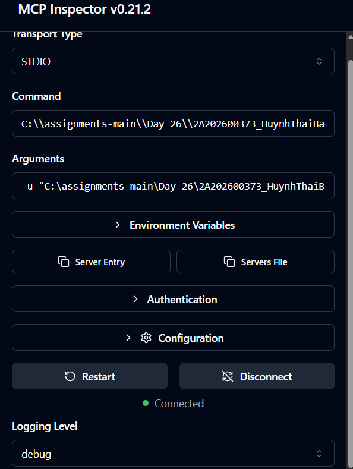
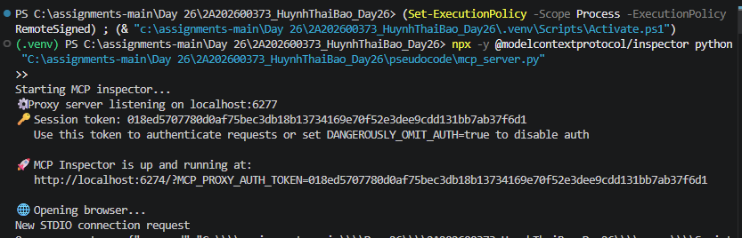
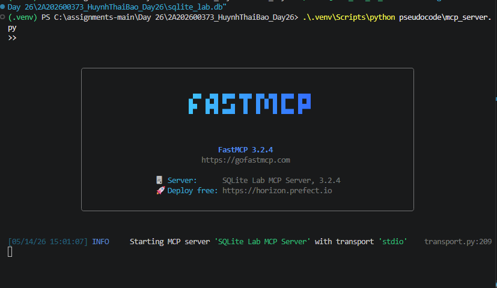
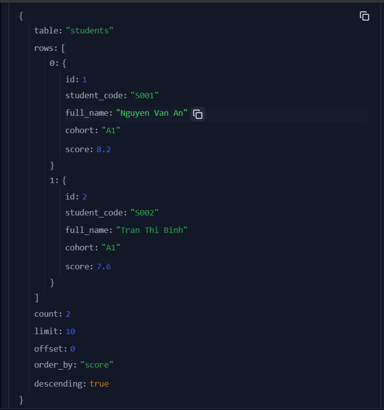
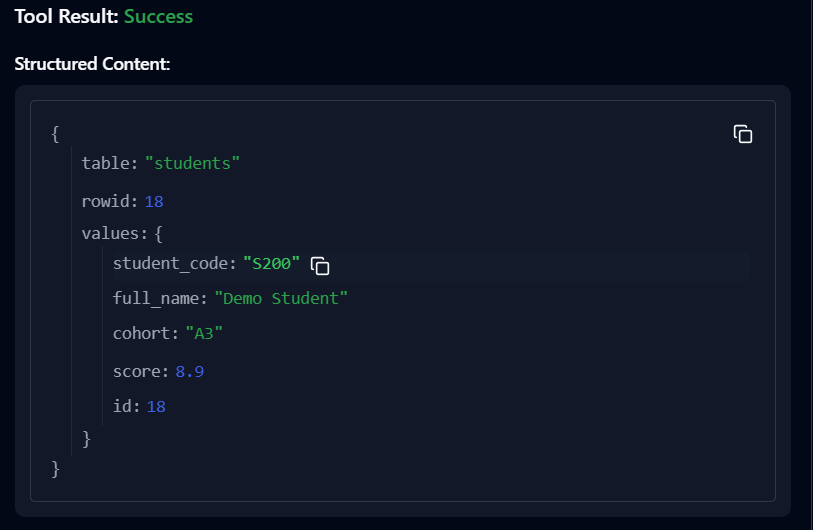
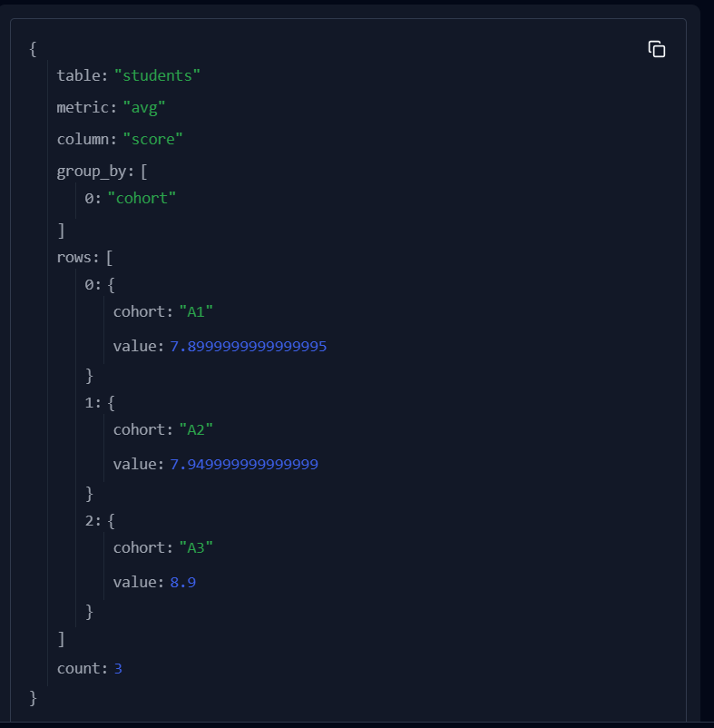
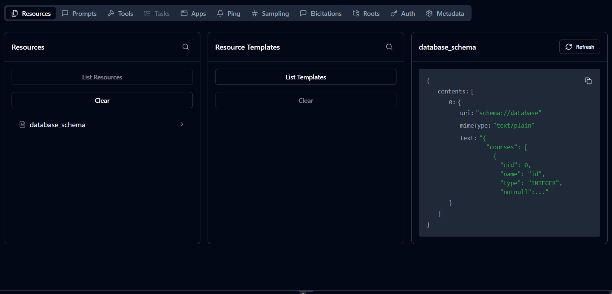
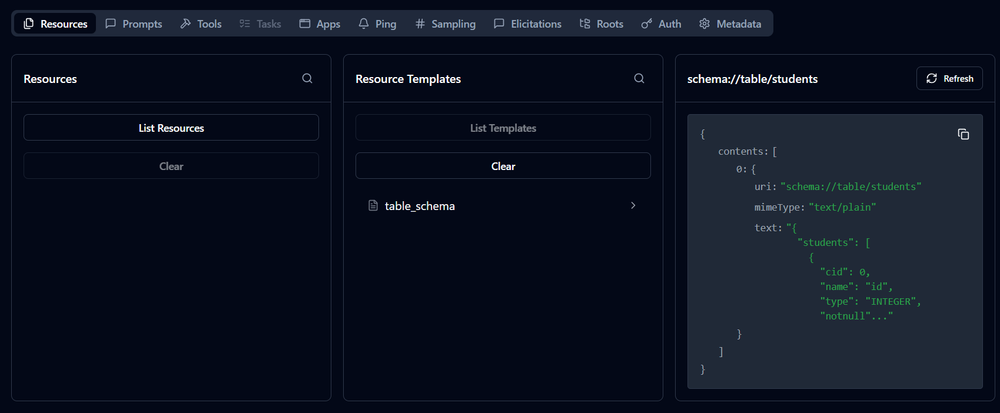
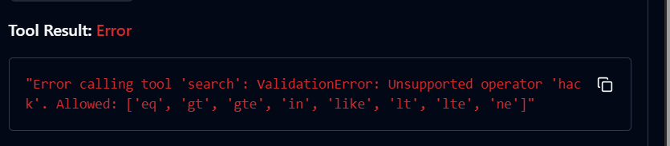

# LAB REPORT - Database MCP Server with FastMCP + SQLite

## 1. Thông tin bài lab
- Họ tên: `HuynhThaiBao`
- Mã số: `2A202600373`
- Mục tiêu: Xây dựng MCP server dùng FastMCP + SQLite với 3 tools (`search`, `insert`, `aggregate`) và 2 resources schema.

## 2. Kiến trúc và file đã triển khai

### 2.1. `pseudocode/init_db.py`
- Tạo schema SQLite gồm 3 bảng:
  - `students`
  - `courses`
  - `enrollments`
- Seed dữ liệu mẫu để demo truy vấn.
- Dùng `INSERT OR IGNORE` để chạy lặp lại không lỗi (idempotent seed).
- Hàm chính: `create_database(...)`.

### 2.2. `pseudocode/db.py`
- Triển khai `SQLiteAdapter`:
  - `list_tables()`
  - `get_table_schema(table)`
  - `search(...)`
  - `insert(table, values)`
  - `aggregate(...)`
- Validation đầu vào:
  - Reject table không tồn tại.
  - Reject column không tồn tại.
  - Reject operator không hỗ trợ.
  - Reject metric aggregate không hỗ trợ.
  - Reject `insert` rỗng.
- SQL an toàn:
  - Sử dụng parameterized query (`?`) cho values/filter values.

### 2.3. `pseudocode/mcp_server.py`
- Khởi tạo server: `FastMCP("SQLite Lab MCP Server")`.
- Expose 3 tools:
  - `search`
  - `insert`
  - `aggregate`
- Expose 2 resources:
  - `schema://database`
  - `schema://table/{table_name}`
- Trả lỗi validation rõ ràng từ tầng adapter.

## 3. Public MCP interface đã cung cấp

### 3.1. Tools
- `search(table, filters=None, columns=None, limit=20, offset=0, order_by=None, descending=False)`
- `insert(table, values)`
- `aggregate(table, metric, column=None, filters=None, group_by=None)`

### 3.2. Resources
- `schema://database`
- `schema://table/{table_name}`

## 4. Kết quả kiểm thử thủ công (Inspector)
- Discover thành công 3 tools.
- Discover thành công schema resources.
- `search` trả đúng dữ liệu có filter/order/pagination.
- `insert` trả payload vừa insert (kèm `rowid`/`id`).
- `aggregate` chạy được `avg` (và hỗ trợ `count/sum/min/max` trong code).
- Validation lỗi hiển thị rõ khi dùng operator sai (`hack`).

## 5. Đối chiếu Rubric
- Server Foundation: Đạt.
- Required Tools: Đạt.
- MCP Resources: Đạt.
- Safety and Error Handling: Đạt.
- Verification: Đạt qua Inspector.
- Client Integration and Demo: Đạt qua MCP Inspector + screenshots.

## 6. Hướng dẫn chạy nhanh
```powershell
# 1) Kích hoạt venv
.venv\Scripts\Activate.ps1

# 2) Cài thư viện
pip install fastmcp

# 3) Chạy server
python pseudocode/mcp_server.py
```

Inspector (terminal khác):
```powershell
npx -y @modelcontextprotocol/inspector python "C:\assignments-main\Day 26\2A202600373_HuynhThaiBao_Day26\pseudocode\mcp_server.py"
```

## 7. Evidence (dán ảnh tại đây)

> Gợi ý lưu ảnh trong: `evidence/screenshots/`

### 7.1. Kết nối server + discover tools




### 7.2. Tool `search` thành công


### 7.3. Tool `insert` thành công


### 7.4. Tool `aggregate` thành công


### 7.5. Resource `schema://database`


### 7.6. Resource `schema://table/students`


### 7.7. Case lỗi validation (operator không hợp lệ)

